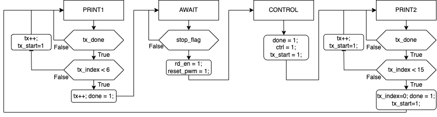

# First homework -> UART controlled PWM LED 

## Objective

The objective of this homework is to develop a system which will control the brightness of an LED using PWM (Pulse Width Modulation) through UART. The user will be able to send commands via a serial terminal to adjust the LED brightness. To do this, you will develop simple digital system using System Verilog, simulate it, and implement it on an FPGA board.

### The instruction format 

The instruction format is as follows:
```
R<VAL_R>G<VAL_G>B<VAL_B>
```
Where:
```
- `<VAL_R>`: Brightness value for the Red LED -> 0,1,2,3 
    - 0: Off
    - 1: 25% brightness
    - 2: 50% brightness
    - 3: 75% brightness
- `<VAL_G>`: Brightness value for the Green LED -> 0,1,2,3 
    - 0: Off
    - 1: 25% brightness
    - 2: 50% brightness
    - 3: 75% brightness
- `<VAL_B>`: Brightness value for the Blue LED -> 0,1,2,3 
    - 0: Off
    - 1: 25% brightness
    - 2: 50% brightness
    - 3: 75% brightness
```

## Instructions

Our design can be broken into two parts: 
  - Datapath 
  - Control Unit
  
### Datapath

The datapath consists of the following modules:
  - UART Receiver: This module receives data from the UART interface and save it to the shift register.
  -  Shift Register: This module is used to store the received command and provide it to the PWM generator.
  - PWM Generator: This module generates PWM signals based on the brightness values coded in the command.
  - UART Transmitter: This module prints the messages back to the terminal to inform the user about the system status.
  





The datapath can be divided in two parts:
-   Receiving Part (top of the image):
    - This part includes the UART Receiver, the Shift Register and PWM controller. The UART Receiver reads the command symbols one at a time and passes each symbol to the Shift Register. (Note: the UART Receiver here does not include an interface circuit.)

    - The Shift Register collects all incoming symbols. Once the entire command has been received, it outputs the full command in parallel to the RGB controller when the Control unit activates the read_en signal.

    - The RGB controller extracts the brightness values from the command or token and uses them to adjust the PWM generator. The token follows this format:
"R<VAL_R>G<VAL_G>B<VAL_B>". By asserting the *ctrl signal*, the Control Unit indicates that a complete command has been received and the PWM generator should update the LED brightness levels accordingly.

-  Transmitting Part (bottom of the image):
   - This part handles sending messages to the UART terminal. It contains the UART Transmitter module. The Control Unit enables the UART Transmitter to send feedback messages to the user, such as "Ready" or "Control".

   - The strings that need to be transmitted are stored in a ROM block (shown as Message). When the Control Unit enables transmission, each character from the stored string is sent to the UART Transmitter one by one. The *tx_index signal selects which character to send next, and the Control Unit updates this index to ensure the characters are transmitted in the correct order.

   - The UART Transmitter sends each character serially to the UART interface, allowing the user to see system status updates on the terminal. The transmission begins when the Control Unit asserts the *tx_start* signal.
  
### Control Unit

The control unit is responsible for controlling the UART receiver, PWM generator, Shift register, and UART transmitter. It consists of a finite state machine (FSM) whose states are as follows:

- PRINT1: Print string "Ready" to the serial terminal.
  - We first check if the current character has been completely transmitted by monitoring the *tx_done* signal from the UART transmitter. 
  - If the transmission is complete, we increment the *tx_index* to point to the next character in the "Ready" string. Note first six location in message memory are "Ready" and sixth location is new line character.
  - After all characters in the "Ready" string have been transmitted, we transition to the AWAIT state. During the transition we increment the *tx_index* one last time to prepare for any future transmissions. Additionally, we assert the *done* signal to reset the shift register, ensuring it is ready to receive new commands.
- AWAIT: Receive the command from the UART receiver.
  - In this state, we monitor the *stop_flag* signal from the UART receiver to determine when a new character has been received.
  - The stop flag indicates that a complete command has been received, when on *rx* we get the new line character (0x0A).
  - As each character is received, we can read the data from the shift register, by asserting the *rd_en* signal. 
- CONTROL: Processes the received command and updates the PWM generator with the new brightness values.
  - this state lasts only one clock cycle.
  - During this state, we extract the brightness values for the Red, Green, and Blue
  - by asserting the *ctrl* signal, we inform the PWM generator to update the LED brightness levels based on the received command.
- PRINT2: Print string "Control" to the serial terminal. 
  - Similar to the PRINT1 state, we print the "Control" message character by character.


### Steps to follow

- Design the UART Transmitter, for help you can refer to the previous lab assignments.
- Design the PWM generator that can generate PWM signals for the three LEDs based on the brightness values. For help, you can refer to the previous lab assignments.
- Design the shift register with parallel load
  - Interface 
```verilog
    module shift_reg_with_par_read #(
        parameter DATA_WIDTH = 8,
        parameter DEPTH = 16
    ) (
        input logic clk,
        input logic rst,
        input logic wr_en,
        input logic rd_en,
        input logic [DATA_WIDTH-1:0] wr_data,
        output logic [DEPTH*DATA_WIDTH-1:0] rd_data
    );
```
  - Ports
    - clk, rst: standard clock and reset signals
    - wr_en: write enable signal to load data into the shift register
    - rd_en: read enable signal to output the parallel data
    - wr_data: input data to be loaded into the shift register
    - rd_data: output parallel data from the shift register

  - Functionality
    - On the rising edge of *clk*, if *wr_en* is high, the input data *wr_data* is loaded into the shift register.
    - If *rd_en* is high, the contents of the shift register are output in parallel on *rd_data*.

- Design the Control Unit FSM to manage the overall operation of the system.
- Integrate all the modules together to form the complete system.
- Simulate the complete system to verify its functionality.
- Synthesize and implement the design on an FPGA board.

## Deliverables

- A complete SystemVerilog code for the UART controlled PWM LED system.
- A testbench for simulating the design.
- A brief report documenting the design process.

### Milestones


- Implement the design without printing messages to the UART terminal. (75% of the grade)
- Complete the design. (100% of the grade)

## Resources

- In the repository, you can find the draft code for the desired system as well as testbenche.
- Reuse the previous modules developed in previous labs.


### Disclaimer

Please note, the provided solution is just a reference implementation. You are encouraged to implement your own version of the design if you wish to do so.

